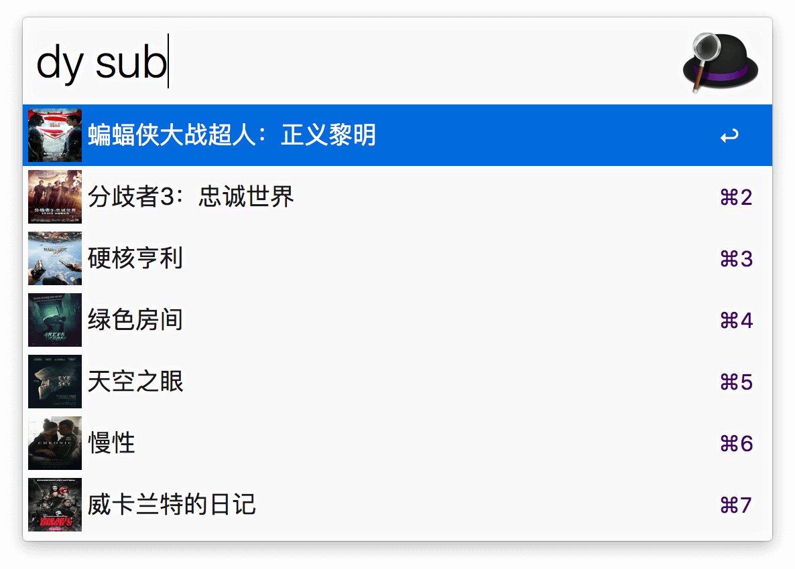
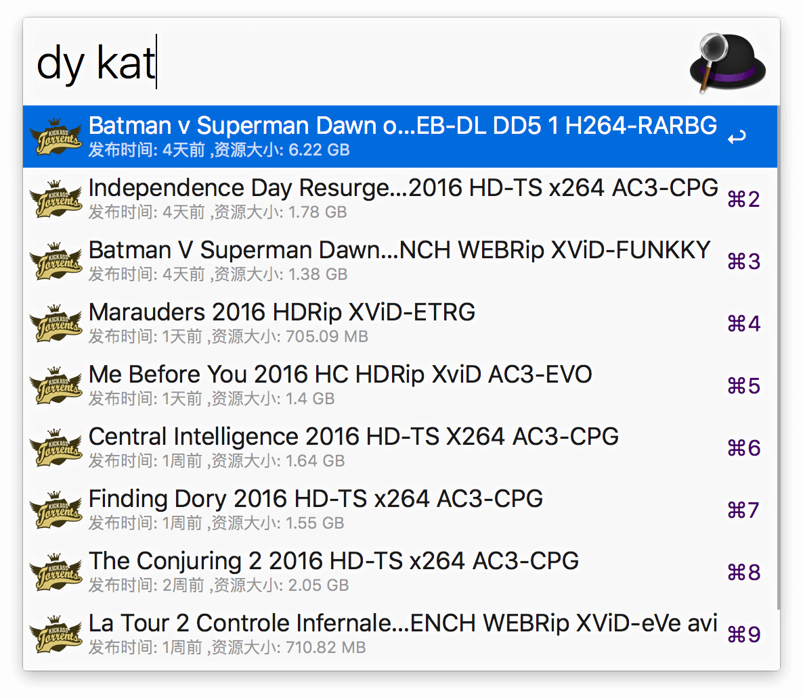
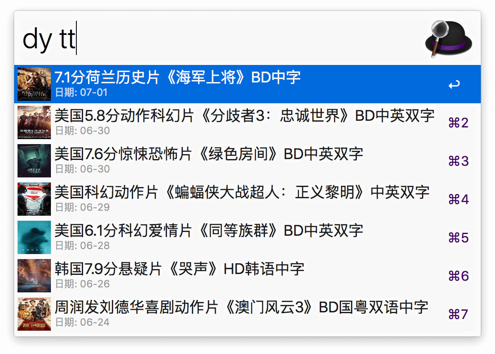

# AlfredWorkflow-DYHub

 一个快速获取SubHD、Kat.cr、电影天堂的资源信息列表的Alfred Workflow
 
 ****
 
 8月3日更新：kat.cr 已挂（创始人被抓），kat 部分暂不可用。
 
## 基本说明

这是一个可以通过Alfred 的关键词快速获取三大电影资源站（[SubHD](http://subhd.com)、[Kat.cr](https://kat.cr)、[电影天堂](http://www.dy2018.com)）最新电影下载资源的Alfred Workflow。使用Python 语言编写( python2 )，支持最新的Alfred 3。

使用本Workflow 前请确保你的Alfred APP 的Powerpack 功能已经解锁。

## 下载地址
 
[点击下载](https://github.com/Jeff2Ma/AlfredWorkflow-DYHub/blob/master/DYHub.alfredworkflow?raw=true)

## 使用方法

下载安装后通过关键词`dy`激活使用：

 

参数对应的命令分别如下：

- `dy sub`：获取SubHD.com 首页热门影视信息

 

- `dy kat`：获取kat.cr 电影栏目的热门资源信息

 

- `dy tt`：获取电影天堂的最新电影资源信息

 

## 独立资源网站 Workflow：

本Workflow 即是通过整合如下三个Workflows 而来。

- [一个快速获取SubHD 热门影视的Alfred Workflow ](https://github.com/Jeff2Ma/AlfredWorkflow-SubHD-HotFilms) 

- [一个快速获取Kat.cr 上热门影视的Alfred Workflow ](https://github.com/Jeff2Ma/AlfredWorkflow-Katcr-Moives)

- [一个快速获取电影天堂上最新资源的Alfred Workflow](https://github.com/Jeff2Ma/AlfredWorkflow-DYTT-NewFilms)

## 注意

本Workflow 需要本机环境安装BeautifulSoup4 包才能正常运行：

	sudo pip install BeautifulSoup4

## 其它

Powered by JeffMa at [DeveWork.com](http://devework.com/)， feel free to use :)

